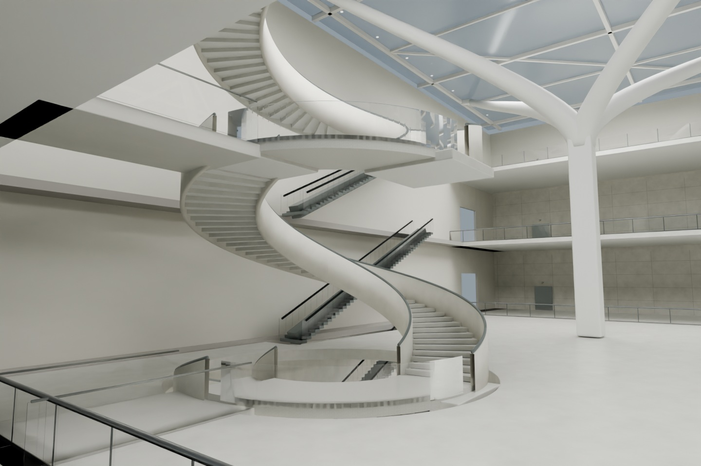

# 湖北省博物馆 · 数字重建

[在线参观](https://estelledc.github.io/hubei-digital-museum/) · [Blender 工程下载](https://github.com/estelledc/hubei-digital-museum/releases/latest) · [来源与边界](research/README.md)

[文物覆盖盘点与后续计划](research/digitization-roadmap.md)：整理 32 项本项目尚未建模的候选、现有 16 组模型的精度欠缺，以及分批制作和验收安排。此轮完成研究收尾，后续建模未启动；不将项目缺项等同于馆方尚未数字化。

一个以现馆公开资料为依据的**非官方数字研究项目**。可以浏览园区与常设展区、近看代表文物，体验编钟击奏、器物结构展开和细节导览。并非馆方网站、测绘模型或文物扫描成果。



## 可以体验什么

- 园区全景、南入口与服务区、南馆中庭、新旧馆连接空间、编钟演奏厅与观景平台。
- 11 个常设展区，各厅选取有公开依据的代表展品，共 16 组文物与展陈模型。
- 编钟击奏、槌与长杆的接触示范、正常与放大运动展示、连续演示和复位。声音为合成演示，不是原钟录音。
- 编磬、铜鼓击奏；尊盘等复杂器物的结构展开；梅瓶等器物的细节导览。
- 旋转、缩放、剖开建筑，以及四处公共空间各三个观察位置。

## 运行网页

需要 Node.js 22.13 或更新版本。

```sh
cd web
npm ci
npm run dev
```

模型以 `.glb.gz` 储存，网页使用浏览器 `DecompressionStream` 解压后交给 Three.js。压缩不减少顶点、不改变动画。首次进入大型场景仍需下载较多数据，建议使用电脑和现代浏览器。

```sh
cd web
npm test
npm run typecheck
MUSEUM_BASE_PATH=/hubei-digital-museum npm run build
cd ..
python3 scripts/stage_pages.py
```

静态入口为 `web/main.tsx`，复用 `web/app/page.tsx` 的现有 React 界面。GitHub Actions 自动构建并将 `.pages/` 发布到 GitHub Pages。修改 `main` 后会重新发布；克隆到其他仓库时，工作流自动使用新仓库名称作为子路径。

## Blender 与模型源码

- Releases 提供 `hubei-museum-public.blend` 和 `interactive-blender-public.zip`，包括全馆工程及 16 个文物交互工程。推荐 Blender 5.2 或更新版本。
- `web/public/models/` 包含网页实际使用的 32 个压缩 GLB；解压即可导入 Blender。
- `scripts/` 保留建模、材质、动画和验证脚本。历史生成器依赖本地阶段存档或研究照片，**仅克隆仓库不能从零重建所有历史版本**。编辑现有成果请优先下载 Release 工程或导入公开 GLB。
- `package_public_models.py` 与 `prepare_blender_release.py` 从本地完整版产生公开衍生版，替换未授权图像并清理本机路径；它们需要本地完整版作为显式输入。

## 公开版与真实性

尺寸、陈列坐标、建筑高程、背面细节和不可见结构存在近似。结构展开用于说明组成，不表示文物实际可拆卸；运动展示不等于力学测量。

公开版移除了馆方、建筑师及官方 VR 的未确认再分发许可的照片和贴图，用近似色材质替代。竹简、稿本、金锭等因此不展示原照片文字；页面注明了这一差异。原有本地研究版没有被覆盖。

开放许可照片的投影纹理保留作者、原图链接、许可和修改说明，见 [署名](research/fidelity-credits.md)。查看和再利用请先读 [权利说明](RIGHTS.md)。

## 验证范围

`npm test` 验证实际交付 GLB 的空间结构、透明栏板、相机视线、剖切、65 个编钟动画片段和另外 15 组文物交互。纹理解码在这些模型测试中使用替身；构建成功不代表浏览器 GPU 视觉验收或实景相似度认证。

发布检查还验证压缩资源下载与解压、静态子路径引用，以及公开文件中的未授权图像和本机路径。详见 [发布记录](reports/publication.md)。
